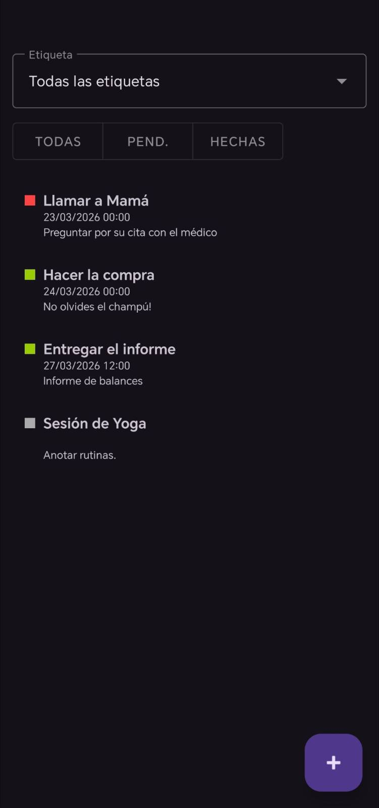
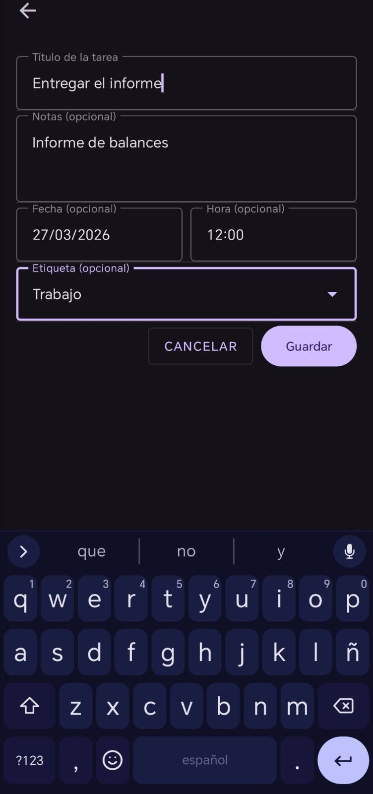

# TaskFlow

TaskFlow es una aplicación Android de gestión de tareas desarrollada como proyecto de aprendizaje dentro del ciclo de Desarrollo de Aplicaciones Multiplataforma (DAM).

## Descripción

La aplicación permite crear, visualizar y editar tareas, almacenando la información localmente en el dispositivo.  
Este proyecto me ha servido para practicar la estructura de una app Android, la navegación entre pantallas y la persistencia de datos.

## Tecnologías utilizadas

- Kotlin
- Android Studio
- Room
- SQLite
- RecyclerView
- Navigation Component
- ViewBinding

## Funcionalidades

- Crear tareas
- Editar tareas
- Visualizar listado de tareas
- Almacenamiento local de datos
- Navegación entre pantallas

## Capturas

## Objetivos de aprendizaje

Con este proyecto he trabajado aspectos como:

- desarrollo de interfaces en Android
- navegación entre pantallas
- persistencia local con Room
- gestión de listas con RecyclerView
- organización básica del código en una aplicación móvil

## Estado del proyecto

Proyecto funcional de aprendizaje y práctica.
